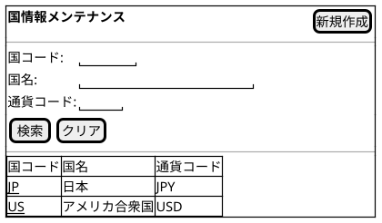
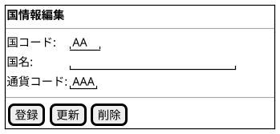

@import "/assets/doc-style.less"

# UI仕様書 国マスタ管理

## 画面定義

- 画面ベース名：国マスタ管理
- 画面タイトル：国情報メンテナンス
- 画面種別：通常
- 入力方式：基本

---

## 画面概要

国情報の検索・一覧表示、および登録・更新・削除を行う画面。顧客情報に紐付いている国情報は削除できない。

---

## 参照データ定義

特になし

---

## 一覧画面

### 画面レイアウト指示

特になし

### 画面ワイヤー

### 項目定義（検索条件）

| 表示順 | 項目名     | UI部品       | 必須 | 入力制約/表示仕様 |
|-------:|------------|--------------|:----:|------------------|
|      1 | 国コード   | テキスト入力 |  -   | -                |
|      2 | 国名       | テキスト入力 |  -   | -                |
|      3 | 通貨コード | テキスト入力 |  -   | -                |

### 項目定義（一覧）

| 表示順 | 項目名     | UI部品       | 必須 | 入力制約/表示仕様                  |
|-------:|------------|--------------|:----:|------------------------------------|
|      1 | 国コード   | リンク       |  -   | クリックで編集ダイアログを開く     |
|      2 | 国名       | テキスト表示 |  -   | -                                  |
|      3 | 通貨コード | テキスト表示 |  -   | -                                  |

### 検索仕様ルール

- ソート順：国コード 昇順

### 項目間ルール（複合チェック）

特になし

### UI状態切替ルール

特になし

---

## 入力フォーム画面

### 画面レイアウト指示

特になし

### 画面ワイヤー

### 項目定義（入力フォーム）

| 表示順 | 項目名     | UI部品       | 必須 | 入力制約/表示仕様                   |
|-------:|------------|--------------|:----:|-------------------------------------|
|      1 | 国コード   | テキスト入力 |  〇  | 2桁・半角英字（大文字）・重複不可   |
|      2 | 国名       | テキスト入力 |  〇  | 50桁以内                            |
|      3 | 通貨コード | テキスト入力 |  〇  | 3桁・半角英字（大文字）             |

### 項目間ルール（複合チェック）

特になし

### UI状態切替ルール

- 新規モード：国コードは入力可
- 更新モード：国コードは読み取り専用
- 顧客情報に紐付いている国情報は [削除] ボタンを非活性とする

---

## 操作

特になし

---

## 未確定事項

特になし

---

## 改訂履歴

| 版数 | 改訂日     | 改訂者  | 改訂内容 |
|------|------------|---------|----------|
| 1.0  | 2026-03-27 | v097053 | 初版作成 |
