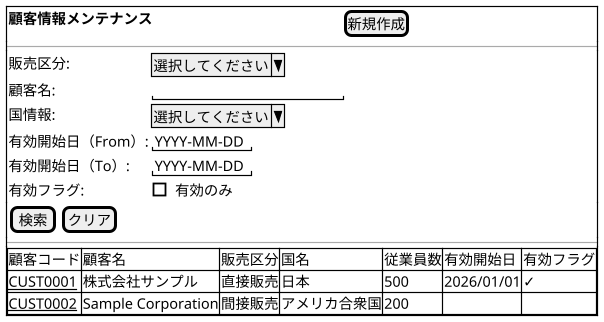
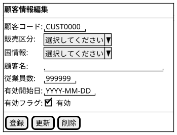

@import "/assets/doc-style.less"

# UI仕様書 顧客マスタ管理

## 画面定義

- 画面ベース名：顧客マスタ管理
- 画面タイトル：顧客情報メンテナンス
- 画面種別：通常
- 入力方式：基本

---

## 画面概要

顧客情報の検索・一覧表示、および登録・更新・削除を行う画面。国情報が事前に登録済みである必要がある。

---

## 参照データ定義

参照_販売区分一覧：
- 取得元：固定値

参照_国情報一覧：
- 取得元：国情報マスタ
- 抽出条件：特になし
- 値：国コード
- 表示：国名

---

## 一覧画面

### 画面レイアウト指示

特になし

### 画面ワイヤー

### 項目定義（検索条件）

| 表示順 | 項目名               | UI部品           | 必須 | 入力制約/表示仕様           |
|-------:|----------------------|------------------|:----:|-----------------------------|
|      1 | 販売区分             | プルダウン入力   |  -   | 参照：販売区分一覧          |
|      2 | 顧客名               | テキスト入力     |  -   | -                           |
|      3 | 国情報               | プルダウン入力   |  -   | 参照：国情報一覧            |
|      4 | 有効開始日（From）   | 日付入力         |  -   | -                           |
|      5 | 有効開始日（To）     | 日付入力         |  -   | -                           |
|      6 | 有効フラグ           | チェックボックス |  -   | デフォルト値：チェックなし  |

### 項目定義（一覧）

| 表示順 | 項目名     | UI部品       | 必須 | 入力制約/表示仕様                  |
|-------:|------------|--------------|:----:|------------------------------------|
|      1 | 顧客コード | リンク       |  -   | クリックで編集ダイアログを開く     |
|      2 | 顧客名     | テキスト表示 |  -   | -                                  |
|      3 | 販売区分   | テキスト表示 |  -   | -                                  |
|      4 | 国名       | テキスト表示 |  -   | -                                  |
|      5 | 従業員数   | テキスト表示 |  -   | カンマ区切り                       |
|      6 | 有効開始日 | テキスト表示 |  -   | YYYY/MM/DD                         |
|      7 | 有効フラグ | テキスト表示 |  -   | ✓ または空欄                       |

### 検索仕様ルール

- ソート順：顧客コード 昇順
- 有効フラグ チェック時は有効フラグが有効のレコードのみを対象とする

### 項目間ルール（複合チェック）

- 有効開始日（From）≦ 有効開始日（To）

### UI状態切替ルール

特になし

---

## 入力フォーム画面

### 画面レイアウト指示

特になし

### 画面ワイヤー

### 項目定義（入力フォーム）

| 表示順 | 項目名     | UI部品           | 必須 | 入力制約/表示仕様                  |
|-------:|------------|------------------|:----:|------------------------------------|
|      1 | 顧客コード | テキスト入力     |  〇  | 8桁・半角英数字・重複不可          |
|      2 | 販売区分   | プルダウン入力   |  〇  | 参照：販売区分一覧                 |
|      3 | 国情報     | プルダウン入力   |  〇  | 参照：国情報一覧                   |
|      4 | 顧客名     | テキスト入力     |  〇  | 255桁以内                          |
|      5 | 従業員数   | 数値入力         |  -   | 0以上                              |
|      6 | 有効開始日 | 日付入力         |  -   | -                                  |
|      7 | 有効フラグ | チェックボックス |  -   | -                                  |

### 項目間ルール（複合チェック）

特になし

### UI状態切替ルール

- 新規モード：顧客コードは入力可
- 更新モード：顧客コードは読み取り専用

---

## 操作

特になし

---

## 未確定事項

特になし

---

## 改訂履歴

| 版数 | 改訂日     | 改訂者  | 改訂内容 |
|------|------------|---------|----------|
| 1.0  | 2026-03-27 | v097053 | 初版作成 |
