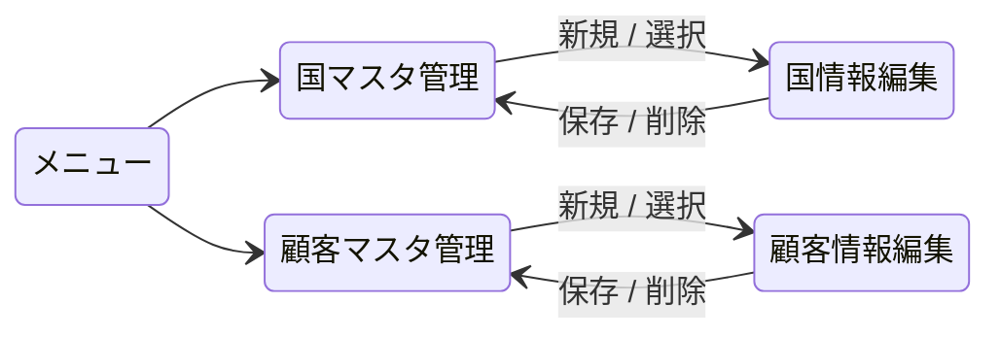
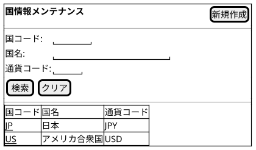
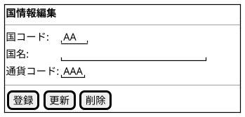
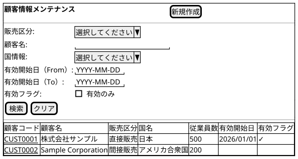
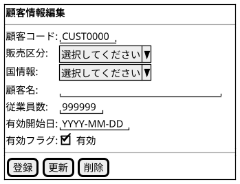
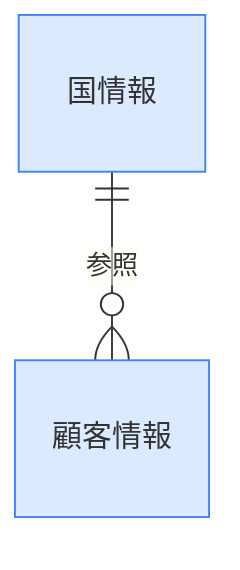

@import "/assets/doc-style.less"

# マスタ管理 外部仕様書

## 画面一覧

| No | 画面名         | 用途                                                           | 画面種別 | 入力方式 | 対象データ（概念） |
|----|----------------|----------------------------------------------------------------|----------|----------|--------------------|
| 1  | 国マスタ管理   | 国情報を検索・一覧表示し、登録・修正・削除を行う               | 通常     | 基本     | 国情報             |
| 2  | 顧客マスタ管理 | 顧客情報を検索・一覧表示し、登録・修正・削除を行う             | 通常     | 基本     | 顧客情報           |

---

## 画面遷移図

---

## 画面イメージ

> ここに記載した画面イメージは、**暫定イメージ**です。UI仕様書を検討後、変更される可能性があります。

### 国マスタ管理画面

国情報を検索・一覧表示し、登録・修正・削除を行う。

#### 一覧画面

#### 入力フォーム画面

---

### 顧客マスタ管理画面

顧客情報を検索・一覧表示し、登録・修正・削除を行う。

#### 一覧画面

#### 入力フォーム画面

---

## バッチ一覧

特になし

---

## データ一覧（概念）

| No | データ名 | 種別   | 説明                                                                           |
|----|----------|--------|--------------------------------------------------------------------------------|
| 1  | 国情報   | マスタ | システム全体で使用する国コード・国名・通貨コードを管理するマスタデータ         |
| 2  | 顧客情報 | マスタ | 営業対象となる顧客の基本情報を管理するマスタデータ。国情報を参照する           |

### データ運用方針

- 国情報・顧客情報ともに削除は完全削除とする
- 顧客情報は国情報を参照するため、国マスタが先に登録されている必要がある
- 国コードはシステム全体で一意とする（新規登録時に重複チェックを行う）
- 顧客コードはシステム全体で一意とする（新規登録時に重複チェックを行う）
- 顧客情報に紐付いている国情報は削除できない（参照整合性の保護）

---

## データモデル（概念）

---

## 未確定事項

特になし

---

## 改訂履歴

| 版数 | 改訂日     | 改訂者  | 改訂内容 |
|------|------------|---------|----------|
| 1.0  | 2026-03-27 | v097053 | 初版作成 |
