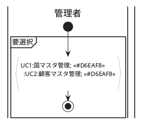
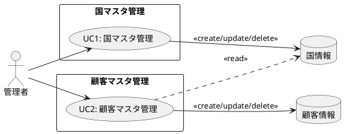

@import "/assets/doc-style.less"

# マスタ管理 業務仕様書

## 目的

本書は、マスタ管理業務の骨格（関係者・業務フロー・ユースケース）を整理し、外部仕様書・UI仕様書・データ定義書の作成および関係者間の認識合わせに使用する。

---

## 対象範囲

- 国情報の検索・登録・修正・削除
- 顧客情報の検索・登録・修正・削除

---

## 関係者（ロール）

| 関係者（実在） | ロール（システム） | 主な責務 |
|----------------|-------------------|----------|
| システム管理者 | 管理者            | 国情報・顧客情報の登録・修正・削除を行う |

---

## 業務の流れ

### マスタ管理フロー

国情報・顧客情報のマスタを登録・修正・削除する。

#### 業務フロー

#### UC構成図

---

## 未確定事項

特になし

---

## 改訂履歴

| 版数 | 改訂日     | 改訂者  | 改訂内容                           |
|------|------------|---------|-----------------------------------|
| 1.0  | 2026-03-04 | v097053 | 国マスタ管理より新規作成        |
| 2.0  | 2026-03-04 | v097053 | 顧客マスタ管理を追加            |
| 2.1  | 2026-03-07 | v097053 | 国コード・顧客コードの一意制約、国情報削除ガードを追記 |
| 3.0  | 2026-03-27 | v097053 | ガイドに従って全面再作成（UC・データ・画面情報を外部仕様書へ移管） |
| 3.1  | 2026/04/15 | v097053 | 単一レーンフローに| |追加 |
