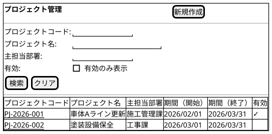
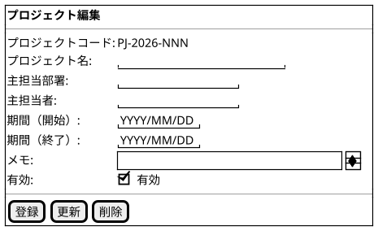

@import "/assets/doc-style.less"

# UI仕様書 プロジェクト管理

## 画面定義

- 画面ベース名：プロジェクト管理
- 画面タイトル：プロジェクト管理
- 画面種別：通常
- 入力方式：基本

## 画面概要

プロジェクトの一覧検索・参照、および登録・更新・無効化を行う画面。
マスタの削除は他データから参照されている場合は実行できない。参照されている場合は有効フラグを無効にして利用停止とする。

## 参照データ定義

特になし

## 一覧画面

### 画面レイアウト指示

特になし

### 画面ワイヤー

### 項目定義（検索条件）

| 表示順 | 項目名             | UI部品           | 必須 | 入力制約/表示仕様              |
| -----: | ------------------ | ---------------- | :--: | ------------------------------ |
|      1 | プロジェクトコード | テキスト入力     |  -   | -                              |
|      2 | プロジェクト名     | テキスト入力     |  -   | -                              |
|      3 | 主担当部署         | テキスト入力     |  -   | -                              |
|      4 | 有効               | チェックボックス |  -   | デフォルト値：チェックなし     |

### 項目定義（一覧）

| 表示順 | 項目名             | UI部品       | 必須 | 入力制約/表示仕様              |
| -----: | ------------------ | ------------ | :--: | ------------------------------ |
|      1 | プロジェクトコード | リンク       |  -   | クリックで編集画面を開く       |
|      2 | プロジェクト名     | テキスト表示 |  -   | -                              |
|      3 | 主担当部署         | テキスト表示 |  -   | -                              |
|      4 | 期間（開始）       | テキスト表示 |  -   | 表示形式：YYYY/MM/DD           |
|      5 | 期間（終了）       | テキスト表示 |  -   | 表示形式：YYYY/MM/DD           |
|      6 | 有効               | テキスト表示 |  -   | 有効の場合：✓、無効：空白     |

### 検索仕様ルール

- ソート順：プロジェクトコード 昇順
- 取得対象外条件：特になし

### 項目間ルール（複合チェック）

特になし

### UI状態切替ルール

特になし

---

## 入力フォーム画面

### 画面レイアウト指示

特になし

### 画面ワイヤー

### 項目定義（入力フォーム）

| 表示順 | 項目名             | UI部品           | 必須 | 入力制約/表示仕様          |
| -----: | ------------------ | ---------------- | :--: | -------------------------- |
|      1 | プロジェクトコード | テキスト表示     |  -   | 初期値：(自動採番)         |
|      2 | プロジェクト名     | テキスト入力     |  〇  | 最大100文字                |
|      3 | 主担当部署         | テキスト入力     |  〇  | 最大100文字                |
|      4 | 主担当者           | テキスト入力     |  〇  | 最大100文字                |
|      5 | 期間（開始）       | 日付入力         |  〇  | -                          |
|      6 | 期間（終了）       | 日付入力         |  〇  | -                          |
|      7 | メモ               | テキストエリア   |  -   | 最大256文字                |
|      8 | 有効               | チェックボックス |  -   | -                          |

### 項目間ルール（複合チェック）

- 期間（終了）は期間（開始）以降の日付を指定すること。

### UI状態切替ルール

- 新規モード：プロジェクトコードは「(自動採番)」として表示し、入力不可。有効は初期値チェック（有効）状態で表示する。
- 更新モード：プロジェクトコードは変更不可。
- 他データから参照されている場合、[削除] ボタンは非活性。

---

## 操作

- [新規作成]：プロジェクトコード に `(自動採番)` を表示する。保存時にシステムが `PJ-YYYY-NNN` で採番する。

## 未確定事項

特になし

## 改訂履歴

| 版数 | 改訂日     | 改訂者  | 改訂内容 |
| ---- | ---------- | ------- | -------- |
| 1.0  | 2026/03/26 | v097053 | 初版作成 |
| 1.1  | 2026/03/27 | v097053 | 操作セクション修正（標準操作を削除、采番記述を修正） |
