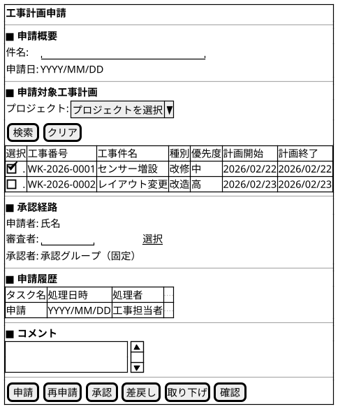
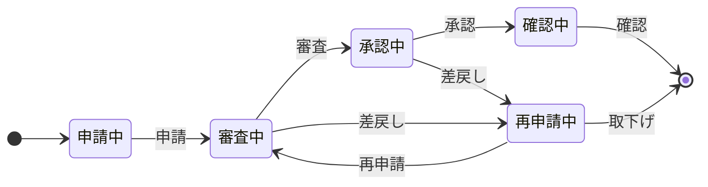

@import "/assets/doc-style.less"

# UI仕様書 工事計画申請

## 画面定義

- 画面ベース名：工事計画申請
- 画面タイトル：工事計画申請
- 画面区分：Workflow

## 画面概要

プロジェクトをキーに未申請の工事計画を複数選択して申請し、審査者・承認者がワークフローで審査・承認を行う画面。
差戻し時は申請者が工事計画を再選択して再申請できる。承認完了後、工事計画が作業可能状態となる。

## 参照データ定義

参照_プロジェクト一覧：
- 取得元：プロジェクト
- 抽出条件：有効なものに限る
- 値：プロジェクトID
- 表示：プロジェクトコード + プロジェクト名

参照_種別一覧：
- 取得元：固定値
- 値・表示：01:改修 / 02:改造 / 03:新設 / 04:撤去

参照_優先度一覧：
- 取得元：固定値
- 値・表示：1:高 / 2:中 / 3:低

## 申請対象工事計画

### 画面レイアウト指示

特になし

### 画面ワイヤー

---

### 項目定義（申請対象工事計画）

| 表示順 | 項目名     | UI部品         | 必須 | 入力制約/表示仕様              |
| -----: | ---------- | -------------- | :--: | ------------------------------ |
|      1 | プロジェクト | プルダウン入力 |  -   | 参照：参照_プロジェクト一覧    |

### 項目定義（工事計画一覧）

| 表示順 | 項目名     | UI部品           | 必須 | 入力制約/表示仕様              |
| -----: | ---------- | ---------------- | :--: | ------------------------------ |
|      1 | 選択       | チェックボックス |  -   | -                              |
|      2 | 工事番号   | テキスト表示     |  -   | -                              |
|      3 | 工事件名   | テキスト表示     |  -   | -                              |
|      4 | 種別       | テキスト表示     |  -   | 参照：参照_種別一覧から名称変換 |
|      5 | 優先度     | テキスト表示     |  -   | 参照：参照_優先度一覧から名称変換 |
|      6 | 計画開始   | テキスト表示     |  -   | 表示形式：YYYY/MM/DD           |
|      7 | 計画終了   | テキスト表示     |  -   | 表示形式：YYYY/MM/DD           |
|      8 | 場所       | テキスト表示     |  -   | -                              |
|      9 | 担当者     | テキスト表示     |  -   | -                              |

### 検索仕様ルール

- ソート順：工事番号 昇順
- 取得対象外条件：申請中（WF処理中）の工事計画は選択対象外（一覧に表示しない）

### 項目間ルール（複合チェック）

- [申請] / [再申請] 実行時、工事計画一覧で1件以上選択されていること。

### UI状態切替ルール

- 申請中および再申請中の状態のみ：工事計画の検索・選択が可能（編集可）。
- その他の状態：選択した工事計画は参照のみ（チェックボックス・検索入力不可）。

---

## 入力項目定義（申請内容）

| 表示順 | 項目名   | UI部品       | 必須 | 入力制約/表示仕様      |
| -----: | -------- | ------------ | :--: | ---------------------- |
|      1 | 件名     | テキスト入力 |  〇  | WF基盤の標準仕様に従う |
|      2 | 申請日   | テキスト表示 |  -   | 表示形式：YYYY/MM/DD   |

## 入力項目定義（承認経路）

| 表示順 | 項目名   | UI部品         | 必須 | 入力制約    |
| -----: | -------- | -------------- | :--: | ----------- |
|      1 | 申請者   | テキスト表示   |  -   | ログインユーザー |
|      2 | 審査者   | 担当者選択部品 |  〇  | -           |
|      3 | 承認者   | テキスト表示   |  -   | 承認グループで固定 |

## 状態遷移図

## UI状態切替ルール

### 操作可能条件

| 状態       | 利用ロール     | 利用可能な操作      |
| ---------- | ---------- | ------------------- |
| 申請中     | 工事担当者 | 申請                |
| 再申請中   | 工事担当者 | 再申請 / 取り下げ   |
| 審査中     | 審査者     | 承認 / 差戻し       |
| 承認中     | 承認者     | 承認 / 差戻し       |
| 確認中     | 工事担当者 | 確認                |

### 編集可能ルール

- 申請内容および承認経路の編集可否は、状態により制御され、「申請中」および「再申請中」の場合のみ編集可。
- コメントは、「確認中」を除く全状態で編集可。

## 操作

特になし

## 未確定事項

特になし

## 改訂履歴

| 版数 | 改訂日     | 改訂者  | 改訂内容 |
| ---- | ---------- | ------- | -------- |
| 1.0  | 2026/03/26 | v097053 | 初版作成 |
| 1.1  | 2026/03/26 | v097053 | 操作可能条件のロールを審査・承認者に統合、確認ステップのTBD追記 |
| 1.2  | 2026/03/27 | v097053 | 操作セクション修正（WF標準ボタンを削除）、未確定事項を解消 |
