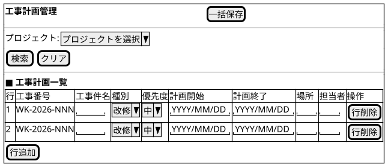

@import "/assets/doc-style.less"

# UI仕様書 工事計画管理

## 画面定義

- 画面ベース名：工事計画管理
- 画面タイトル：工事計画管理
- 画面種別：通常
- 入力方式：一括

## 画面概要

プロジェクトをキーとして絞り込んだ工事計画を、一括で登録・編集する画面。
申請中（WF処理中）の工事計画は変更不可とし、差戻し時のみ変更可とする。

## 参照データ定義

参照_プロジェクト一覧：
- 取得元：プロジェクト
- 抽出条件：有効なものに限る
- 値：プロジェクトID
- 表示：プロジェクトコード + プロジェクト名

参照_種別一覧：
- 取得元：固定値
- 値・表示：01:改修 / 02:改造 / 03:新設 / 04:撤去

参照_優先度一覧：
- 取得元：固定値
- 値・表示：1:高 / 2:中 / 3:低

## 工事計画管理画面

### 画面レイアウト指示

特になし

### 画面ワイヤー

### 項目定義（検索条件）

| 表示順 | 項目名       | UI部品         | 必須 | 入力制約/表示仕様              |
| -----: | ------------ | -------------- | :--: | ------------------------------ |
|      1 | プロジェクト | プルダウン入力 |  -   | 参照：参照_プロジェクト一覧    |

### 項目定義（一覧編集）

| 表示順 | 項目名     | UI部品         | 必須 | 入力制約/表示仕様          |
| -----: | ---------- | -------------- | :--: | -------------------------- |
|      1 | 工事番号   | テキスト表示   |  -   | 初期値：(自動採番)         |
|      2 | 工事件名   | テキスト入力   |  〇  | 最大100文字                |
|      3 | 種別       | プルダウン入力 |  〇  | 参照：参照_種別一覧        |
|      4 | 優先度     | プルダウン入力 |  -   | 参照：参照_優先度一覧      |
|      5 | 計画開始   | 日付入力       |  〇  | -                          |
|      6 | 計画終了   | 日付入力       |  〇  | -                          |
|      7 | 場所       | テキスト入力   |  -   | 最大100文字                |
|      8 | 担当者     | テキスト入力   |  〇  | 最大100文字                |

### 検索仕様ルール

- ソート順：工事番号 昇順
- 取得対象外条件：特になし

### 項目間ルール（複合チェック）

- 計画終了は計画開始以降の日付を指定すること。

### UI状態切替ルール

- 申請中（WF処理中）の工事計画行：すべての入力項目が参照のみ（編集不可）。[行削除] ボタンは非活性。
- 差戻し中の工事計画行：すべての入力項目が編集可能。

---

## 操作

- [行追加]：工事番号 に `(自動採番)` を表示する。[一括保存] 時にシステムが `WK-YYYY-NNNN` で採番する。

## 未確定事項

特になし

## 改訂履歴

| 版数 | 改訂日     | 改訂者  | 改訂内容 |
| ---- | ---------- | ------- | -------- |
| 1.0  | 2026/03/26 | v097053 | 初版作成 |
| 1.1  | 2026/03/27 | v097053 | 操作セクション修正（標準操作を削除、采番記述を修正） |
