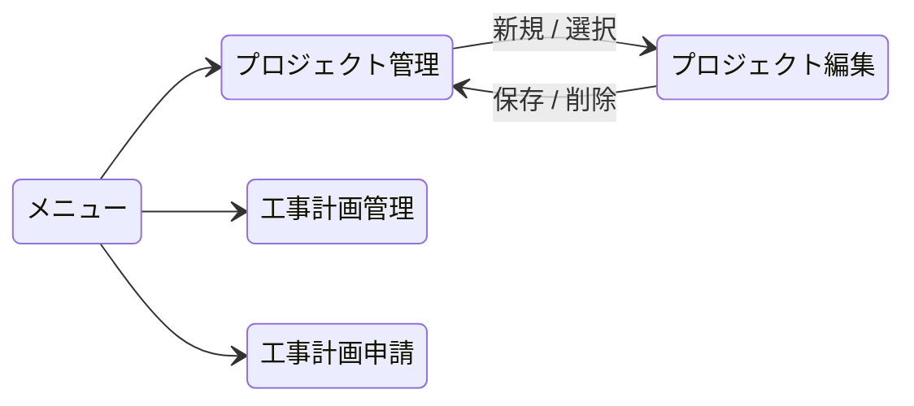
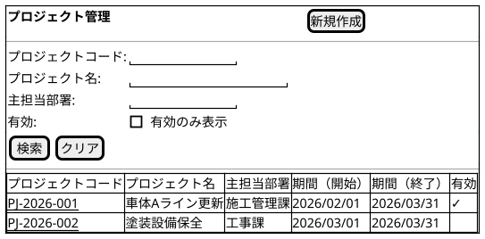
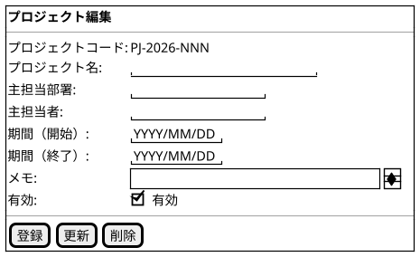
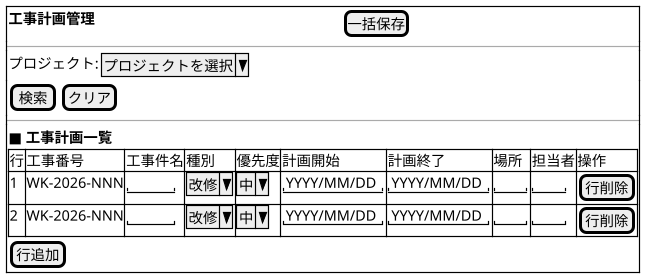
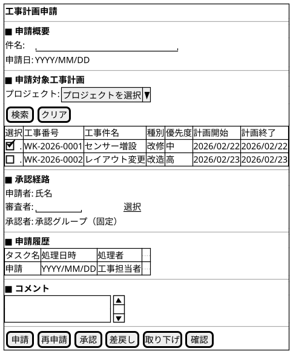
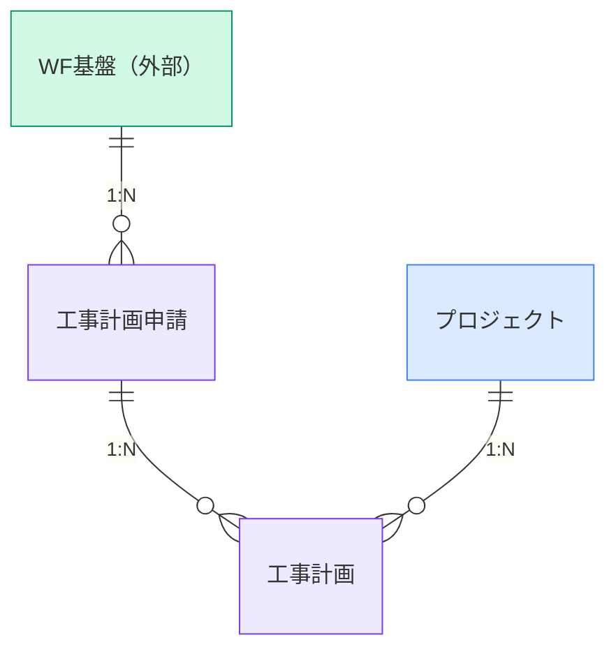

@import "/assets/doc-style.less"

# 工事管理 外部仕様書

## 画面一覧

| No | 画面名           | 用途                                                               | 画面種別  | 入力方式   | 対象データ（概念） |
| -- | ---------------- | ------------------------------------------------------------------ | --------- | ---------- | ------------------ |
| 1  | プロジェクト管理 | プロジェクトを登録・管理する                                       | 通常      | 基本       | プロジェクト       |
| 2  | 工事計画管理     | プロジェクトをキーに工事計画を一括で登録・編集する                 | 通常      | 一括       | 工事計画           |
| 3  | 工事計画申請     | 工事計画を複数選択してワークフローで申請・審査・承認する           | Workflow  | 親子選択   | 工事計画申請       |

---

## 画面遷移図

---

## 画面イメージ

> ここに記載した画面イメージは、**暫定イメージ**です。UI仕様書を検討後、変更される可能性があります。

### プロジェクト管理画面

プロジェクトを登録・管理する。

#### 一覧画面

#### 入力フォーム画面

---

### 工事計画管理画面

プロジェクトをキーに工事計画を一括で登録・編集する。

---

### 工事計画申請画面

工事計画を複数選択してワークフローで申請・審査・承認する。

---

## バッチ一覧

- 特になし

---

## データ一覧（概念）

| No | データ名     | 種別             | 説明                                                         |
| -- | ------------ | ---------------- | ------------------------------------------------------------ |
| 1  | WF基盤       | 外部システム       | ワークフローの状態・状態遷移・担当者を管理する外部基盤       |
| 2  | 工事計画申請 | トランザクション | 工事計画のワークフロー申請内容を管理するデータ               |
| 3  | プロジェクト | マスタ           | 工事計画をまとめる上位の計画単位を管理するデータ             |
| 4  | 工事計画     | トランザクション | プロジェクト配下の個別工事の計画内容を管理するデータ         |
| 5  | 種別         | 定数             | 工事の種類を表す区分値                                       |
| 6  | 優先度       | 定数             | 工事計画の優先度を表す区分値                                 |

### データ運用方針

- マスタの削除は、他データで参照（利用）されている場合は実行できない。
- 参照（利用）されているマスタは、有効フラグを無効にして利用停止とする。
- ワークフロー申請対象のデータは、申請データと紐付けるため申請元データのIDを保持する。
- 申請後の申請対象データは変更不可とし、差戻し時のみ変更可とする。

---

## データモデル（概念）

---

## 未確定事項

特になし

---

## 改訂履歴

| 版数 | 改訂日     | 改訂者  | 改訂内容 |
| ---- | ---------- | ------- | -------- |
| 1.0  | 2026/03/26 | v097053 | 初版作成 |
| 1.1  | 2026/04/15 | v097053 | WF基盤を外部システムに変更。ER図に色分類追加、（概念）ラベルを削除 |
