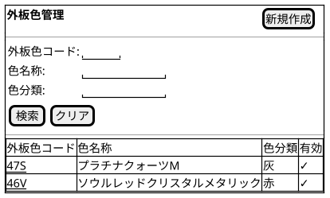
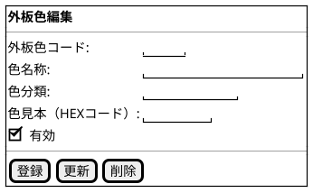

@import "/assets/doc-style.less"

# UI仕様書 外板色管理

## 画面定義

- 画面ベース名：外板色管理
- 画面タイトル：外板色管理
- 画面種別：通常
- 入力方式：基本

---

## 画面概要

外板色マスタを登録・管理する。AICコードから外板色情報への変換情報を管理する。削除は他データから参照されている場合は実行できず、その場合は有効フラグを無効にして利用停止とする。

---

## 参照データ定義

特になし

---

## 一覧画面

### 画面レイアウト指示

特になし

### 画面ワイヤー

### 項目定義（検索条件）

| 表示順 | 項目名       | UI部品           | 必須 | 入力制約/表示仕様                   |
|--------|--------------|------------------|:----:|------------------------------------|
| 1      | 外板色コード | テキスト入力     | -    | 3文字固定、半角英数字（大文字）     |
| 2      | 色名称       | テキスト入力     | -    | -                                   |
| 3      | 色分類       | テキスト入力     | -    | -                                   |
| 4      | 有効         | チェックボックス | -    | デフォルト値：チェックなし          |

### 項目定義（一覧）

| 表示順 | 項目名       | UI部品       | 必須 | 入力制約/表示仕様 |
|--------|--------------|--------------|:----:|-----------------|
| 1      | 外板色コード | リンク       | -    | -               |
| 2      | 色名称       | テキスト表示 | -    | -               |
| 3      | 色分類       | テキスト表示 | -    | -               |
| 4      | 有効         | テキスト表示 | -    | ✓ または空欄   |

### 検索仕様ルール

- ソート順：外板色コード 昇順

### 項目間ルール（複合チェック）

特になし

### UI状態切替ルール

特になし

---

## 入力フォーム画面

### 画面レイアウト指示

特になし

### 画面ワイヤー

### 項目定義（入力フォーム）

| 表示順 | 項目名       | UI部品               | 必須 | 入力制約/表示仕様                               |
|--------|--------------|----------------------|:----:|------------------------------------------------|
| 1      | 外板色コード | テキスト入力         | 〇   | 3文字固定、半角英数字（大文字）、重複不可       |
| 2      | 色名称       | テキスト入力         | 〇   | 最大100文字                                    |
| 3      | 色分類       | テキスト入力         | 〇   | 最大100文字                                    |
| 4      | 色見本       | カラーパレット入力   | -    | 6文字固定、半角英数字（大文字）（# 除く。例：FF0000） |
| 5      | 有効         | チェックボックス     | -    | -                                              |

### 項目間ルール（複合チェック）

特になし

### UI状態切替ルール

- 新規モード
  - 外板色コードは入力可。
- 更新モード
  - 外板色コードは編集不可（テキスト表示）。

---

## 操作

- [新規作成] ボタン押下
  - ②入力フォームを新規モードで表示する。
- 外板色コード リンク押下
  - ②入力フォームを更新モードで表示する。

---

## 未確定事項

特になし

---

## 改訂履歴

| 版数 | 改訂日     | 改訂者  | 改訂内容                                     |
|------|------------|---------|----------------------------------------------|
| 1.0  | 2026/03/26 | v097053 | 新ガイド形式で統合（一覧・入力を1ファイルに結合） |
