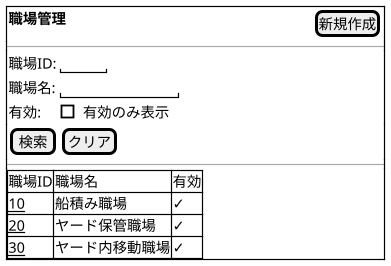
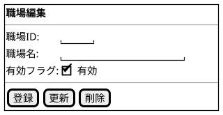

@import "/assets/doc-style.less"

# UI仕様書 職場管理

## 画面定義

- 画面ベース名：職場管理
- 画面タイトル：職場管理
- 画面種別：通常
- 入力方式：基本

---

## 画面概要

職場マスタを登録・管理する。削除は他データから参照されている場合は実行できず、その場合は有効フラグを無効にして利用停止とする。

---

## 参照データ定義

特になし

---

## 一覧画面

### 画面レイアウト指示

特になし

### 画面ワイヤー

### 項目定義（検索条件）

| 表示順 | 項目名 | UI部品           | 必須 | 入力制約/表示仕様                        |
|--------|--------|------------------|:----:|----------------------------------------|
| 1      | 職場ID | テキスト入力     | -    | 最大3文字、半角英数字（大文字）          |
| 2      | 職場名 | テキスト入力     | -    | -                                       |
| 3      | 有効   | チェックボックス | -    | デフォルト値：チェックなし               |

### 項目定義（一覧）

| 表示順 | 項目名 | UI部品       | 必須 | 入力制約/表示仕様 |
|--------|--------|--------------|:----:|-----------------|
| 1      | 職場ID | リンク       | -    | -               |
| 2      | 職場名 | テキスト表示 | -    | -               |
| 3      | 有効   | テキスト表示 | -    | ✓ または空欄   |

### 検索仕様ルール

- ソート順：職場ID 昇順

### 項目間ルール（複合チェック）

特になし

### UI状態切替ルール

特になし

---

## 入力フォーム画面

### 画面レイアウト指示

特になし

### 画面ワイヤー

### 項目定義（入力フォーム）

| 表示順 | 項目名 | UI部品           | 必須 | 入力制約/表示仕様                               |
|--------|--------|------------------|:----:|------------------------------------------------|
| 1      | 職場ID | テキスト入力     | 〇   | 最大3文字、半角英数字（大文字）、重複不可       |
| 2      | 職場名 | テキスト入力     | 〇   | 最大100文字                                    |
| 3      | 有効   | チェックボックス | -    | -                                              |

### 項目間ルール（複合チェック）

特になし

### UI状態切替ルール

- 新規モード
  - 職場IDは入力可。
- 更新モード
  - 職場IDは編集不可（テキスト表示）。

---

## 操作

- [新規作成] ボタン押下
  - ②入力フォームを新規モードで表示する。
- 職場ID リンク押下
  - ②入力フォームを更新モードで表示する。

---

## 未確定事項

特になし

---

## 改訂履歴

| 版数 | 改訂日     | 改訂者  | 改訂内容                                     |
|------|------------|---------|----------------------------------------------|
| 1.0  | 2026/03/26 | v097053 | 新ガイド形式で統合（一覧・入力を1ファイルに結合） |
