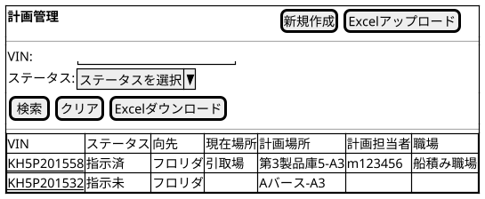
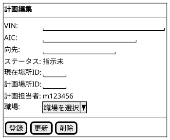

@import "/assets/doc-style.less"

# UI仕様書 計画管理

## 画面定義

- 画面ベース名：計画管理
- 画面タイトル：計画管理
- 画面種別：通常
- 入力方式：基本

---

## 画面概要

全ステータスの車両ロケーション計画を一覧表示し、新規登録・更新・指示内容の変更を行う画面。ステータスにかかわらず指示内容を変更可能。Excelによる一括アップロード・ダウンロードにも対応する。

---

## 参照データ定義

参照_ステータス一覧：
- 取得元：固定値

参照_職場一覧：
- 取得元：職場マスタ
- 抽出条件：有効のみ
- 値：職場ID
- 表示：職場名

---

## 一覧画面

### 画面レイアウト指示

特になし

### 画面ワイヤー

### 項目定義（検索条件）

| 表示順 | 項目名     | UI部品         | 必須 | 入力制約/表示仕様                         |
|--------|------------|----------------|:----:|------------------------------------------|
| 1      | VIN        | テキスト入力   | -    | 17文字固定、半角英数字（大文字）          |
| 2      | AIC        | テキスト入力   | -    | 13文字固定、半角英数字（大文字）          |
| 3      | 向先       | テキスト入力   | -    | -                                         |
| 4      | ステータス | プルダウン入力 | -    | 参照：参照_ステータス一覧                 |
| 5      | 職場       | プルダウン入力 | -    | 参照：参照_職場一覧                       |

### 項目定義（一覧）

| 表示順 | 項目名     | UI部品       | 必須 | 入力制約/表示仕様                             |
|--------|------------|--------------|:----:|----------------------------------------------|
| 1      | VIN        | リンク       | -    | -                                             |
| 2      | AIC        | テキスト表示 | -    | -                                             |
| 3      | 向先       | テキスト表示 | -    | -                                             |
| 4      | ステータス | テキスト表示 | -    | -                                             |
| 5      | 現在場所   | テキスト表示 | -    | 保管場所マスタの工場＋エリアを連結して表示    |
| 6      | 計画場所   | テキスト表示 | -    | 保管場所マスタの工場＋エリアを連結して表示    |
| 7      | 計画担当者 | テキスト表示 | -    | -                                             |
| 8      | 職場       | テキスト表示 | -    | -                                             |

### 出力定義（Excel）

- 出力単位：1件 = 1行
- 出力対象：検索結果全件

| 出力順 | 列名       | 出力内容                         |
|--------|------------|----------------------------------|
| 1      | VIN        | VIN（17桁）                      |
| 2      | AIC        | AIC（13桁）                      |
| 3      | 向先       | 向先名称                         |
| 4      | ステータス | ステータス名称                   |
| 5      | 現在場所ID | 保管場所ID                       |
| 6      | 計画場所ID | 保管場所ID                       |
| 7      | 計画担当者 | 計画担当者ID                     |
| 8      | 職場       | 職場名                           |

### 検索仕様ルール

- 取得対象外条件：特になし（全ステータスを対象とする）
- ソート順：VIN 昇順

### 項目間ルール（複合チェック）

特になし

### UI状態切替ルール

特になし

---

## 入力フォーム画面

### 画面レイアウト指示

特になし

### 画面ワイヤー

### 項目定義（入力フォーム）

| 表示順 | 項目名     | UI部品         | 必須 | 入力制約/表示仕様                                                 |
|--------|------------|----------------|:----:|------------------------------------------------------------------|
| 1      | VIN        | テキスト入力   | 〇   | 17文字固定、半角英数字（大文字）、重複不可                        |
| 2      | AIC        | テキスト入力   | 〇   | 13文字固定、半角英数字（大文字）                                  |
| 3      | 向先       | テキスト入力   | 〇   | 最大100文字                                                       |
| 4      | ステータス | テキスト表示   | -    | 新規登録時：指示未（固定）。更新時：現在値を表示                   |
| 5      | 現在場所ID | テキスト入力   | -    | 最大4文字、半角英数字（大文字）。保管場所IDを直接入力              |
| 6      | 計画場所ID | テキスト入力   | -    | 最大4文字、半角英数字（大文字）。保管場所IDを直接入力              |
| 7      | 計画担当者 | テキスト表示   | -    | 登録時のログインIDを自動セット。変更不可                           |
| 8      | 職場       | プルダウン入力 | -    | 参照：参照_職場一覧                                               |

### 項目間ルール（複合チェック）

- 現在場所ID・計画場所ID・計画担当者・職場がすべて入力された場合、保存時にステータスを自動的に「指示済」に変更する。

### UI状態切替ルール

- 新規モード
  - ステータスは「指示未」を固定表示する。
- 更新モード
  - ステータスは現在値を表示する。

---

## 操作

- [新規作成] ボタン押下
  - ②入力フォームを新規モードで表示する。
- VIN リンク押下
  - ②入力フォームを更新モードで表示する。
- [Excelダウンロード] ボタン押下
  - 現在の検索条件に合致するデータをExcelファイルとしてダウンロードする。
- [Excelアップロード] ボタン押下
  - Excelファイルを選択し、複数件の計画データを一括で登録・更新する。

---

## 未確定事項

特になし

---

## 改訂履歴

| 版数 | 改訂日     | 改訂者  | 改訂内容                                     |
|------|------------|---------|----------------------------------------------|
| 1.0  | 2026/03/26 | v097053 | 新ガイド形式で統合（一覧・入力を1ファイルに結合） |
| 1.1  | 2026/03/26 | v097053 | TBD解消：Excelアップロードエラー処理（全件差し戻し）・現在場所/計画場所の表示形式（工場＋エリア連結）確定 |
