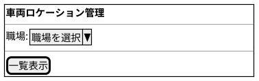
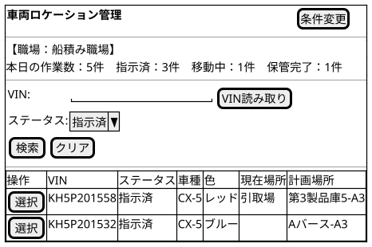
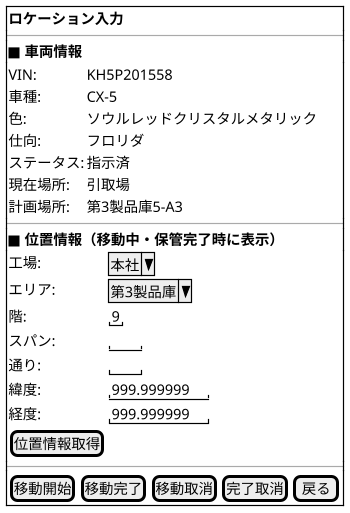

@import "/assets/doc-style.less"

# UI仕様書 車両ロケーション管理

## 画面定義

- 画面ベース名：車両ロケーション管理
- 画面タイトル（条件設定）：車両ロケーション管理
- 画面タイトル（一覧表示）：車両ロケーション管理
- 画面種別：コンテキスト
- 入力方式：基本

---

## 画面概要

モバイル端末向けの車両移動操作画面。担当職場を条件として選択し、VINまたはステータスで車両を絞り込んで、対象車両の移動操作（移動開始・完了・取消）を行う。

---

## 参照データ定義

参照_職場一覧：
- 取得元：職場マスタ
- 抽出条件：有効のみ
- 値：職場ID
- 表示：職場名

参照_ステータス一覧：
- 取得元：固定値

参照_工場一覧：
- 取得元：保管場所マスタ
- 抽出条件：有効のみ、工場の一意リスト
- 値：工場
- 表示：工場

参照_エリア一覧：
- 取得元：保管場所マスタ
- 抽出条件：選択中の工場に紐付くエリアの一意リスト
- 値：エリア
- 表示：エリア

参照_階一覧：
- 取得元：保管場所マスタ
- 抽出条件：選択中の工場・エリアに紐付く階の一意リスト（NULL除く）
- 値：階
- 表示：階

参照_スパン一覧：
- 取得元：保管場所マスタ
- 抽出条件：選択中の工場・エリア・階に紐付くスパンの一意リスト（NULL除く）
- 値：スパン
- 表示：スパン

参照_通り一覧：
- 取得元：保管場所マスタ
- 抽出条件：選択中の工場・エリア・階・スパンに紐付く通りの一意リスト（NULL除く）
- 値：通り
- 表示：通り

---

## 職場選択画面

### 画面レイアウト指示

特になし

### 画面ワイヤー

### 項目定義（条件設定）

| 表示順 | 項目名 | UI部品         | 必須 | 入力制約/表示仕様      |
|--------|--------|----------------|:----:|----------------------|
| 1      | 職場   | プルダウン入力 | 〇   | 参照：参照_職場一覧   |

### 項目間ルール（複合チェック）

特になし

### UI状態切替ルール

特になし

---

## ロケーション一覧画面

### 画面レイアウト指示

特になし

### 画面ワイヤー

### 項目定義（サマリ）

| 表示順 | 項目名         | 表示仕様                                                               |
|--------|----------------|------------------------------------------------------------------------|
| 1      | 本日の作業数   | 当日にステータスが指示済・移動中・保管完了に変化した件数の合計（N件） |
| 2      | 指示済         | 現在ステータスが指示済の件数（N件）                                    |
| 3      | 移動中         | 現在ステータスが移動中の件数（N件）                                    |
| 4      | 保管完了       | 現在ステータスが保管完了の件数（N件）                                  |

### 項目定義（一覧内検索）

| 表示順 | 項目名     | UI部品         | 必須 | 入力制約/表示仕様                                |
|--------|------------|----------------|:----:|------------------------------------------------|
| 1      | VIN        | テキスト入力   | -    | 17文字固定、半角英数字（大文字）。完全一致検索  |
| 2      | ステータス | プルダウン入力 | -    | 参照：参照_ステータス一覧。デフォルト：指示済   |

### 項目定義（一覧）

| 表示順 | 項目名     | UI部品       | 必須 | 入力制約/表示仕様              |
|--------|------------|--------------|:----:|-------------------------------|
| 1      | 選択       | ボタン       | -    | -                             |
| 2      | VIN        | テキスト表示 | -    | -                             |
| 3      | ステータス | テキスト表示 | -    | -                             |
| 4      | 車種       | テキスト表示 | -    | -                             |
| 5      | 色         | テキスト表示 | -    | -                             |
| 6      | 仕向       | テキスト表示 | -    | -                             |
| 7      | 現在場所   | テキスト表示 | -    | → 表示仕様ルール参照          |
| 8      | 計画場所   | テキスト表示 | -    | → 表示仕様ルール参照          |

### 表示仕様ルール

**現在場所・計画場所の表示**

- **通常表示（テキスト）**：保管場所IDをそのまま表示する。
- **ホバー時（ツールチップ）**：保管場所マスタの `<工場> <エリア> <階>F <スパン>-<通り>列` 形式で名称を表示する。階・スパン・通りは値がない場合は省略する。

### 検索仕様ルール

- 取得対象外条件：選択した職場に紐付く車両ロケーションのみ取得する
- ソート順：ステータス（指示済→移動中→保管完了→指示未の順）、VIN 昇順

### 項目間ルール（複合チェック）

特になし

### UI状態切替ルール

- 職場（親条件）が未設定の場合、一覧表示画面へ遷移せず①職場選択へ誘導する。

---

## ロケーション入力画面

### 画面レイアウト指示

特になし

### 画面ワイヤー

### 項目定義（車両情報）

| 表示順 | 項目名     | UI部品       | 必須 | 入力制約/表示仕様              |
|--------|------------|--------------|:----:|-------------------------------|
| 1      | VIN        | テキスト表示 | -    | -                             |
| 2      | 車種       | テキスト表示 | -    | -                             |
| 3      | 色         | テキスト表示 | -    | -                             |
| 4      | 仕向       | テキスト表示 | -    | -                             |
| 5      | ステータス | テキスト表示 | -    | -                             |
| 6      | 現在場所   | テキスト表示 | -    | → 表示仕様ルール参照          |
| 7      | 計画場所   | テキスト表示 | -    | → 表示仕様ルール参照          |

### 項目定義（位置情報）

| 表示順 | 項目名 | UI部品         | 必須 | 入力制約/表示仕様                                                    |
|--------|--------|----------------|:----:|---------------------------------------------------------------------|
| 1      | 工場   | プルダウン入力 | -    | 参照：参照_工場一覧                                                  |
| 2      | エリア | プルダウン入力 | -    | 参照：参照_エリア一覧（工場選択後に絞り込み）                        |
| 3      | 階     | プルダウン入力 | -    | 参照：参照_階一覧（工場・エリア選択後に絞り込み）                    |
| 4      | スパン | プルダウン入力 | -    | 参照：参照_スパン一覧（工場・エリア・階選択後に絞り込み）            |
| 5      | 通り   | プルダウン入力 | -    | 参照：参照_通り一覧（工場・エリア・階・スパン選択後に絞り込み）      |
| 6      | 緯度   | 数値入力       | -    | 8桁以内の小数                                                        |
| 7      | 経度   | 数値入力       | -    | 8桁以内の小数                                                        |

### 項目間ルール（複合チェック）

- [移動完了] 実行時、工場・エリア・階・スパン・通りのうち、保管場所マスタに値が設定されている項目が必須となる。緯度・経度は任意。

### UI状態切替ルール

- 位置情報エリア（工場・エリア・階・スパン・通り・緯度・経度・[位置情報取得]）は、ステータスが「移動中」または「保管完了」の場合のみ表示する。
- 工場・エリア・階・スパン・通りは連動絞り込みを行う。工場を選択するとエリアが絞り込まれ、エリアを選択すると階が絞り込まれ、階を選択するとスパンが絞り込まれ、スパンを選択すると通りが絞り込まれる。
- ボタンはステータスに応じて以下のとおり表示を切り替える。

| ボタン     | 表示条件（ステータス） |
|------------|----------------------|
| [移動開始] | 指示済               |
| [移動完了] | 移動中               |
| [移動取消] | 移動中               |
| [完了取消] | 保管完了             |

---

## 操作

- [一覧表示] ボタン押下（①職場選択）
  - 職場を親条件として保持し、②ロケーション一覧に遷移する。
- [VIN読み取り] ボタン押下（②ロケーション一覧）
  - カメラを起動してVINバーコードを読み取り、VIN欄に自動入力した後、[検索]と同等の絞り込みを自動実行する。
- [条件変更] ボタン押下（②ロケーション一覧）
  - ①職場選択に戻る。
- [選択] ボタン押下（②ロケーション一覧）
  - ③ロケーション入力を表示する。
- [位置情報取得] ボタン押下（③ロケーション入力）
  - GPSから現在地の緯度・経度を取得し、緯度・経度の入力欄に自動セットする。
- [移動開始] ボタン押下（③ロケーション入力）
  - ステータスを「移動中」に変更する。
- [移動完了] ボタン押下（③ロケーション入力）
  - 位置情報（工場・エリア・階・スパン・通り・緯度・経度）を実績場所として登録し、ステータスを「保管完了」に変更する。ドライバーIDにログインIDを自動セットする。
- [移動取消] ボタン押下（③ロケーション入力）
  - ステータスを「指示済」に戻す。
- [完了取消] ボタン押下（③ロケーション入力）
  - ステータスを「移動中」に戻す。
- [戻る] ボタン押下（③ロケーション入力）
  - ②ロケーション一覧に戻る。

---

## 未確定事項

特になし

---

## 改訂履歴

| 版数 | 改訂日     | 改訂者  | 改訂内容                                     |
|------|------------|---------|----------------------------------------------|
| 1.0  | 2026/03/26 | v097053 | 新ガイド形式で統合（一覧・入力を1ファイルに結合） |
