@import "/assets/doc-style.less"

# 車両ロケーション管理 外部仕様書

## 画面一覧

| No | 画面名               | 用途                                                                             | 画面種別     | 入力方式 | 対象データ（概念）  |
|----|--------------------|----------------------------------------------------------------------------------|-----------|---------|--------------------|
| 1  | 保管場所管理         | 保管場所マスタを登録・管理する                                                       | 通常        | 基本     | 保管場所            |
| 2  | 職場管理             | 職場マスタを登録・管理する                                                           | 通常        | 基本     | 職場                |
| 3  | 車種管理             | 車種マスタを登録・管理する                                                           | 通常        | 親子     | 車種                |
| 4  | 外板色管理           | 外板色マスタを登録・管理する                                                         | 通常        | 基本     | 外板色              |
| 5  | 計画管理             | 車両ロケーション計画を全ステータス横断で登録・指示設定する（Excelアップロード・ダウンロードによる一括メンテも可能） | 通常 | 基本     | 車両ロケーション    |
| 6  | 車両ロケーション管理 | 職場を選択し、担当する車両の移動操作を行う（モバイル端末向け）                          | コンテキスト | 基本     | 車両ロケーション    |

---

## 画面遷移図

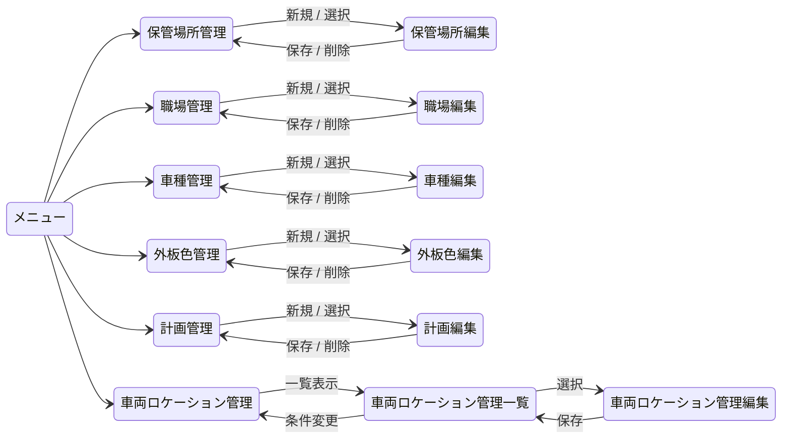

---

## 画面イメージ

> ここに記載した画面イメージは、**暫定イメージ**です。UI仕様書を検討後、変更される可能性があります。

---

### 保管場所管理画面

保管場所マスタを登録・管理する

#### 一覧画面

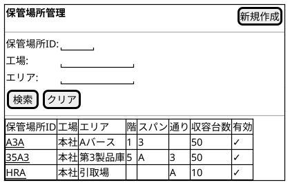

#### 入力フォーム画面

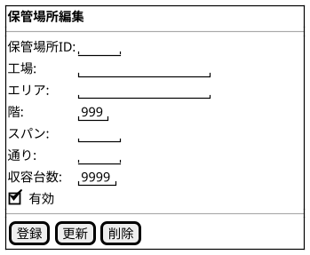

---

### 職場管理画面

職場マスタを登録・管理する

#### 一覧画面

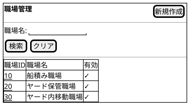

#### 入力フォーム画面

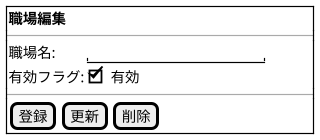

---

### 車種管理画面

車種マスタを登録・管理する

#### 一覧画面

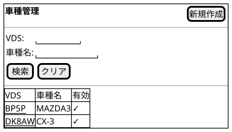

#### 入力フォーム画面

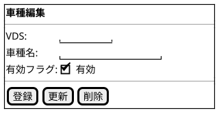

---

### 外板色管理画面

外板色マスタを登録・管理する

#### 一覧画面

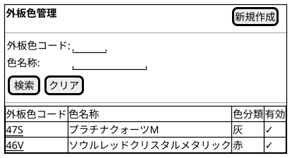

#### 入力フォーム画面

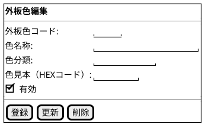

---

### 計画管理画面

車両ロケーション計画を全ステータス横断で登録・指示設定する（Excelアップロード・ダウンロードによる一括メンテも可能）

#### 一覧画面

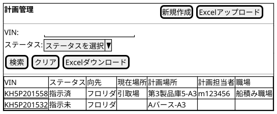

#### 入力フォーム画面

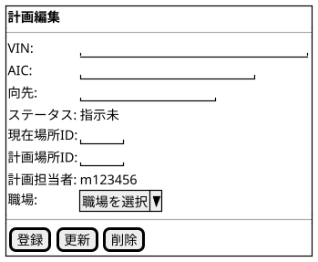

---

### 車両ロケーション管理画面

職場を選択し、担当する車両の移動操作を行う（モバイル端末向け）

#### 職場選択画面

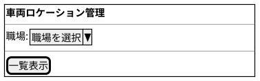

#### ロケーション一覧画面

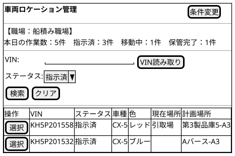

#### ロケーション入力画面

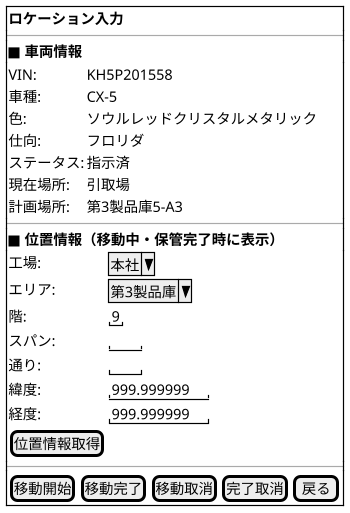

---

## バッチ一覧

- 特になし

---

## データ一覧（概念）

| No | データ名         | 種別           | 説明                                                 |
|----|----------------|--------------|------------------------------------------------------|
| 1  | 車両ロケーション  | トランザクション | 車両の計画・移動状況・実績位置情報を管理するデータ         |
| 2  | 保管場所         | マスタ          | 車両を保管する区画（エリア・階など）の情報               |
| 3  | 職場             | マスタ          | 保管指示を受ける職場の情報                              |
| 4  | 車種             | マスタ          | VDSコードから車種名称へ変換するための情報               |
| 5  | 外板色           | マスタ          | AICコードから外板色名称へ変換するための情報             |
| 6  | ステータス        | 定数           | 車両ロケーションの現在状態を表す値                      |

### データ運用方針

- マスタの削除は、他データで参照（利用）されている場合は実行できない。
- 参照（利用）されているマスタは、有効フラグを無効にして利用停止とする。

---

## データモデル（概念）

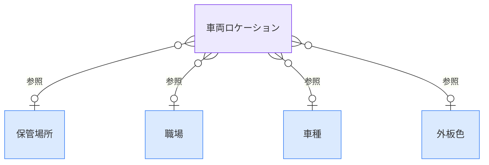

---

## 未確定事項

特になし

---

## 改訂履歴

| 版数 | 改訂日     | 改訂者  | 改訂内容 |
| ---- | ---------- | ------- | -------- |
| 1.0  | 2026/03/26 | v097053 | 初版作成 |
| 1.1  | 2026/04/15 | v097053 | データモデルのERD修正（外洿色→外板色誤字修正、ラベルを「参照」に統一、コードブロック閉じ記号修正） |
