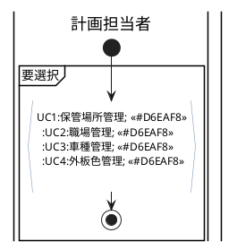
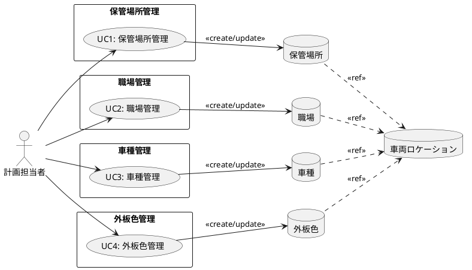
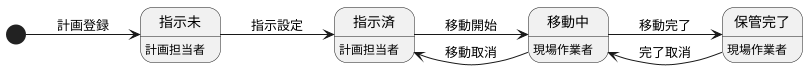
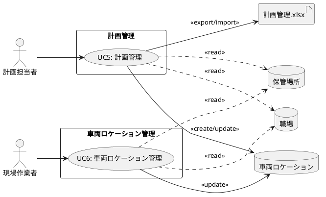

@import "/assets/doc-style.less"


# 車両ロケーション管理 業務仕様書

## 目的

本書は、車両ロケーション管理業務の骨格（関係者・業務フロー・ユースケース）を整理し、関係者間の認識を揃えることを目的とする。

---

## 対象範囲

- 保管場所マスタの管理
- 職場マスタの管理
- 車種マスタの管理（VDS→車種変換）
- 外板色マスタの管理（AIC→外板色変換）
- 車両ロケーション計画の登録・指示設定（Excelアップロード・ダウンロードによる一括メンテを含む）
- 車両ロケーションの移動操作（モバイル端末：移動開始・移動完了・移動取消・完了取消）

---

## 関係者（ロール）

| 関係者（実在）         | ロール（システム） | 主な責務                                                               |
| -------------------- | --------------- | -------------------------------------------------------------------- |
| 物流部 ロケーション係  | 計画担当者       | 車両ロケーション計画の登録・指示設定、各マスタの管理                        |
| 物流部 現場スタッフ    | 現場作業者       | モバイル端末を用いた車両の移動操作（移動開始・移動完了・移動取消・完了取消） |

---

## 業務の流れ

### マスタ管理

#### 業務フロー

計画担当者が各種マスタ（保管場所・職場・車種・外板色）を登録・更新する流れを表す。



#### UC構成図



---

### 計画登録・移動操作

#### 業務フロー

計画担当者が車両ロケーション計画を登録・指示設定し、現場作業者がモバイル端末で移動操作を行う流れを表す。

```plantuml
@startuml フロー2_計画登録・移動操作
skinparam backgroundColor white
skinparam activityBorderColor #6c8ebf
skinparam activityBackgroundColor #ffffff

|計画担当者|
start

:UC5:計画管理; <<#D6EAF8>>
:現場へ移動指示を展開する;

|現場作業者|
:UC6:車両ロケーション管理; <<#D6EAF8>>

stop

@enduml
```

#### 状態遷移図

計画担当者による計画登録・指示設定から、現場作業者のモバイル端末操作（移動開始・移動完了・移動取消・完了取消）を経て保管完了に至る、車両ロケーションのステータス遷移を表す。



#### UC構成図



---

## 未確定事項

特になし

---

## 改訂履歴

| 版数 | 改訂日     | 改訂者  | 改訂内容                                                                                             |
| ---- | ---------- | ------- | ---------------------------------------------------------------------------------------------------- |
| 2.0  | 2026/03/26 | v097053 | 新ガイド対応：4章を業務フロー（PlantUML）＋UC構成図形式に全面改訂、画面一覧・データ一覧・データモデルを外部仕様書に移行 |
| 2.1  | 2026/03/26 | v097053 | UC操作詳細・ステータス遷移のnoteを削除（外部仕様書/UI仕様書へ委譲） |
| 2.2  | 2026/03/26 | v097053 | UC5の計画管理.xlsxをexport→export/importに変更 |
| 2.3  | 2026/03/27 | v097053 | フロー2のシステム表現アクティビティを業務的引継ぎ表現（現場へ移動指示を展開する）に修正 |
| 2.4  | 2026/04/15 | v097053 | group構文修正（end group→{}）、フロー1 note削除・単一レーン| |追加・外板色管理誤字修正、フロー2 note削除・状態遷移図追加（ステータス遷移詳細表は不要のため含まず） |
| 2.5  | 2026/04/15 | v097053 | 状態遷移図の位置をUC構成図の前に移動、説明文追加 |
