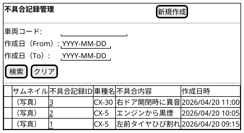
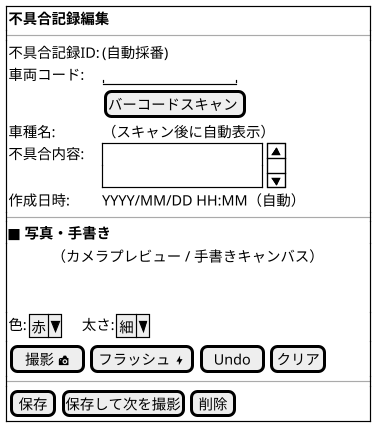

@import "/assets/doc-style.less"

# UI仕様書 不具合記録管理

## 画面定義

- 画面ベース名：不具合記録管理
- 画面タイトル（一覧）：不具合記録管理
- 画面タイトル（編集）：不具合記録編集
- 画面種別：通常
- 入力方式：基本

## 画面概要

現場作業員がバーコードスキャンで対象車両を特定し、写真撮影・手書き注釈・テキストで不具合を記録する画面。登録済みの記録を一覧で確認し、詳細の閲覧・削除も行う。タブレット（iPad）・スマートフォン横向き利用を想定し、オフライン環境でも動作する。

## 参照データ定義

参照_車両マスタ：
- 取得元：車両マスタ
- 抽出条件：特になし
- 値：車両コード
- 表示：車両コード + 車種名

参照_手書き色：
- 取得元：固定値
- 選択肢：赤 / 青 / 黄色 / 白

参照_手書き太さ：
- 取得元：固定値
- 選択肢：細 / 中 / 太

---

## 一覧画面

### 画面レイアウト指示

- 検索エリアは初期展開表示
- 一覧にサムネイル列を設ける（1行1レコード）
- サムネイルをタップするとフルサイズ画像をモーダル表示する
- 一覧は作成日時の降順で表示する
- ボタン・タップ領域は大きめにする（タブレット片手操作を考慮）

### 画面ワイヤー

### 項目定義（検索条件）

| 表示順 | 項目名         | UI部品       | 必須 | 入力制約/表示仕様                         |
|:------:|--------------|:-----------:|:----:|----------------------------------------|
| 1      | 車両コード     | テキスト入力  | -    | 半角数字、10桁固定、部分一致検索           |
| 2      | 作成日（From） | 日付入力      | -    | YYYY-MM-DD 形式                          |
| 3      | 作成日（To）   | 日付入力      | -    | YYYY-MM-DD 形式                          |

### 項目定義（一覧）

| 表示順 | 項目名       | UI部品     | 必須 | 入力制約/表示仕様                              |
|:------:|------------|:----------:|:----:|----------------------------------------------|
| 1      | （サムネイル）| 画像表示    | -    | 手書き込み済みサムネイル。タップでフルサイズモーダル表示 |
| 2      | 不具合記録ID | テキスト表示 | -    | リンク形式。クリックで入力フォーム画面へ遷移         |
| 3      | 車種名       | テキスト表示 | -    | 車両マスタから取得した車種名                       |
| 4      | 不具合内容   | テキスト表示 | -    | 先頭50文字で打ち切り表示（全文はフォームで確認）       |
| 5      | 作成日時     | テキスト表示 | -    | YYYY/MM/DD HH:MM 形式。降順ソート               |

### 検索仕様ルール

- ソート順：作成日時 降順（固定）
- 最大表示件数：50件（以降は非表示）

### 項目間ルール（複合チェック）

- 作成日（From）≦ 作成日（To）であること

### UI状態切替ルール

- 特になし

---

## 入力フォーム画面

### 画面レイアウト指示

- フォームは1カラム構成
- 「写真・手書き」エリアをフォームの中央に大きく配置する（タブレット横向き利用を考慮）
- 撮影・Undo・クリアなどのアクションボタンは大きめにする
- 色・太さ選択はプルダウン形式
- フラッシュボタンはトグル（ON/OFF切替）
- 「保存して次を撮影」は保存後に車両コードを引き継いだまま新規入力フォームを表示する

### 画面ワイヤー

### 項目定義（入力フォーム）

| 表示順 | 項目名       | UI部品          | 必須 | 入力制約/表示仕様                                          |
|:------:|------------|:---------------:|:----:|----------------------------------------------------------|
| 1      | 不具合記録ID | テキスト表示     | -    | 初期値：(自動採番)                                         |
| 2      | 車両コード   | テキスト入力     | 〇   | 半角数字、10桁固定。バーコードスキャンボタンで自動入力可     |
| 3      | 車種名       | テキスト表示     | -    | 車両コード入力後に車両マスタから自動取得して表示             |
| 4      | 不具合内容   | テキストエリア   | -    | 最大256文字                                               |
| 5      | 作成日時     | テキスト表示     | -    | 初期値：端末ローカル日時を自動セット（編集不可）              |

### 項目定義（写真・手書き）

| 表示順 | 項目名         | UI部品          | 必須 | 入力制約/表示仕様                                               |
|:------:|--------------|:---------------:|:----:|---------------------------------------------------------------|
| 1      | カメラ/キャンバス | カメラプレビュー＋キャンバスオーバーレイ | - | カメラプレビュー上に手書きキャンバスを重ねて表示              |
| 2      | 色選択         | プルダウン入力   | -    | 参照：手書き色。デフォルト：赤                                  |
| 3      | 太さ選択       | プルダウン入力   | -    | 参照：手書き太さ。デフォルト：細                                |
| 4      | 撮影ボタン     | ボタン           | -    | タップでシャッター。撮影後、画像をキャンバスに表示              |
| 5      | フラッシュボタン | ボタン（トグル） | -    | タップでON/OFF切替。デフォルト：OFF                            |
| 6      | Undoボタン     | ボタン           | -    | 直前の手書きストロークを1つ取り消す                            |
| 7      | クリアボタン   | ボタン           | -    | キャンバス上の手書き描画をすべて消去する（写真は消えない）        |

### 項目間ルール（複合チェック）

- 保存時、車両コードが車両マスタに存在しない場合はエラーを表示する

### UI状態切替ルール

| 状態             | 対象項目・ボタン | 挙動                                               |
|----------------|:-------------:|----------------------------------------------------|
| 新規モード       | 不具合記録ID   | `(自動採番)` を表示。保存時にシステムが採番する           |
| 新規モード       | 削除ボタン     | 非表示                                              |
| 更新モード       | 不具合記録ID   | 採番済みIDを表示（編集不可）                           |
| 更新モード       | 保存ボタン     | 「保存」ボタンのみ有効（「保存して次を撮影」は非表示）     |
| 車両コード未入力 | 車種名         | 空白を表示                                           |
| 写真未撮影       | Undo / クリア  | 非活性                                              |
| 写真未撮影       | 保存 / 保存して次を撮影 | 非活性（写真撮影が保存の必須条件）               |

---

## 操作

- **[新規作成]**：不具合記録IDに `(自動採番)` を表示する。保存時にシステムがサロゲートキー（自動連番整数）で採番する。
- **[バーコードスキャン]**：カメラでバーコードをスキャンし、読み取った値を車両コード欄に自動入力する。車両マスタに一致するレコードがあれば車種名を自動表示する。
- **[保存して次を撮影]**：現在のレコードを保存後、車両コードを引き継いだ状態で新規入力フォームを開く。
- **サムネイルタップ（一覧）**：該当レコードの手書き込み済み画像をフルサイズでモーダル表示する。

## 未確定事項

特になし

## 改訂履歴

| 版数 | 改訂日     | 改訂者   | 改訂内容   |
|:---:|------------|---------|----------|
| 1.0 | 2026-04-21 | v097053 | 初版作成   |
| 1.1 | 2026-04-21 | v097053 | TBD解消：不具合記録IDをサロゲートキーに変更、写真撮影を保存の必須条件に変更 |
