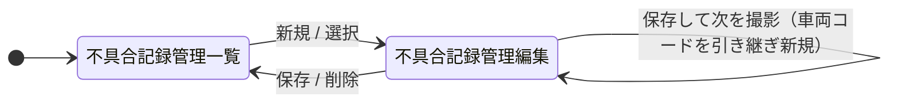
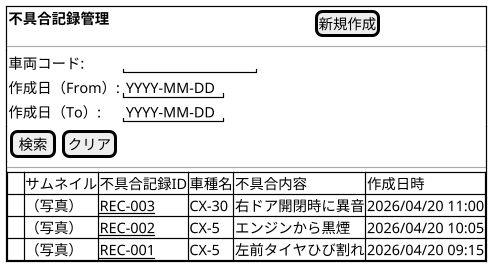
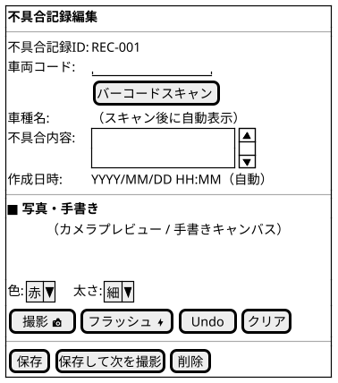
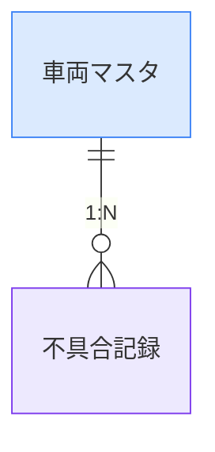

@import "/assets/doc-style.less"

# 車両不具合管理 外部仕様書

## 画面一覧

| No | 画面名         | 用途                                                                                           | 画面種別 | 入力方式 | 対象データ（概念）         |
|:--:|--------------|----------------------------------------------------------------------------------------------|:------:|:-------:|-------------------------|
|  1 | 不具合記録管理 | 不具合記録を一覧で確認し、車両コードスキャン・写真撮影・手書き注釈・不具合内容テキストで記録を登録する | 通常   | 基本     | 不具合記録、車両マスタ    |

## 画面遷移図

## 画面イメージ

> ここに記載した画面イメージは、**暫定イメージ**です。UI仕様書を検討後、変更される可能性があります。

---

### 不具合記録管理画面

不具合記録をサムネイル一覧で確認し、車両を指定して写真撮影・手書き注釈で不具合写真を登録する。

※サムネイルタップでフルサイズ画像をモーダル表示。写真撮影・手書きはサブ画面（撮影・手書きキャンバス）で実施。

#### 一覧画面

#### 入力フォーム画面

## バッチ一覧

- 特になし

## データ一覧（概念）

| No | データ名     | 種別           | 説明                                                                 |
|:--:|------------|:-------------:|--------------------------------------------------------------------|
|  1 | 不具合記録   | トランザクション | 1件の不具合写真・手書き注釈・不具合内容テキストをまとめた記録データ（1レコード＝1枚） |
|  2 | 車両マスタ   | マスタ          | バーコードで識別する車両の基本情報を保持するデータ                         |
|  3 | 手書き色     | 定数            | 手書き注釈に使用できる色の固定値（赤・青・黄色・白）                       |

### データ運用方針

- 特になし

## データモデル（概念）

## 未確定事項

特になし

## 改訂履歴

| 版数 | 改訂日     | 改訂者   | 改訂内容     |
|:---:|------------|---------|------------|
| 1.0 | 2026-04-20 | v097053 | 初版作成     |
| 1.1 | 2026-04-21 | v097053 | 撮影・手書き要件詳細化に伴い全面改訂（2画面構成へ変更） |
| 1.2 | 2026-04-21 | v097053 | 画面構成を通常＋親子に変更（不具合記録管理の1画面に統合） |
| 1.3 | 2026-04-21 | v097053 | 1:1構成に戻しシンプル化。不具合内容テキスト・連続撮影を追加 |
