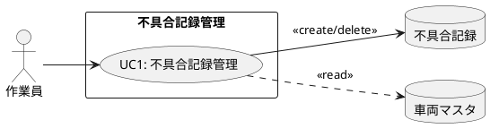

@import "/assets/doc-style.less"

# 車両不具合管理 業務仕様書

## 目的

本書は、車両不具合管理PoC（概念実証）アプリの業務骨格を整理し、バーコードスキャン・連続撮影・手書きマーキング・オフライン保存を組み合わせた不具合写真記録フローを定義する。OutSystemsへの移行判断に向けた業務設計の共通認識を確立することを目的とする。

## 対象範囲

- バーコードスキャン（またはカメラ読み取り）による対象車両の特定
- 写真撮影（連続撮影対応・フラッシュON/OFF・再撮影対応）
- 写真上への手書きマーキング（色選択・線の太さ変更・Undo・クリア）
- 手書き注釈合成済み画像の端末ローカル保存（オフライン対応）
- 撮影済み写真のサムネイルグリッド一覧表示（新しい順・最大50件）
- 撮影済み写真のフルサイズ詳細表示（モーダル）
- 車両マスタは事前登録とし、管理画面は対象外
- サーバー同期・管理者による対応状態管理はPoCスコープ外（将来拡張）

## 関係者（ロール）

| 関係者（実在）        | ロール（システム） | 主な責務                                                         |
|--------------------|:---------------|--------------------------------------------------------------|
| 現場作業員・点検担当者 | 作業員           | 現場で車両の不具合を写真撮影・手書きマーキングで記録する |

## 業務の流れ

### 不具合写真記録・確認フロー

#### 業務フロー

現場作業員がタブレット（iPad等）を使って車両のバーコードをスキャンし、写真撮影・手書きマーキングで不具合を記録し、一覧で確認するフロー。タブレット・スマートフォン横向き利用を想定し、オフライン環境でも動作する。

```plantuml
@startuml フロー_不具合写真記録確認
skinparam backgroundColor white
skinparam activityBorderColor #6c8ebf
skinparam activityBackgroundColor #ffffff

|作業員|
start
:UC1:不具合記録管理; <<#D6EAF8>>
stop
| |
@enduml
```

#### UC構成図



## 未確定事項

特になし

## 改訂履歴

| 版数 | 改訂日     | 改訂者   | 改訂内容                   |
|:---:|------------|---------|--------------------------|
| 1.0 | 2026-04-20 | v097053 | 初版作成（口頭ヒアリングより） |
| 1.1 | 2026-04-21 | v097053 | 撮影・手書き要件詳細化に伴い全面改訂 |
| 1.2 | 2026-04-21 | v097053 | 画面構成を通常＋親子に変更（UCを不具合記録管理に統合） |
| 1.3 | 2026-04-21 | v097053 | 1:1構成に戻しシンプル化。不具合内容テキスト追加 |
